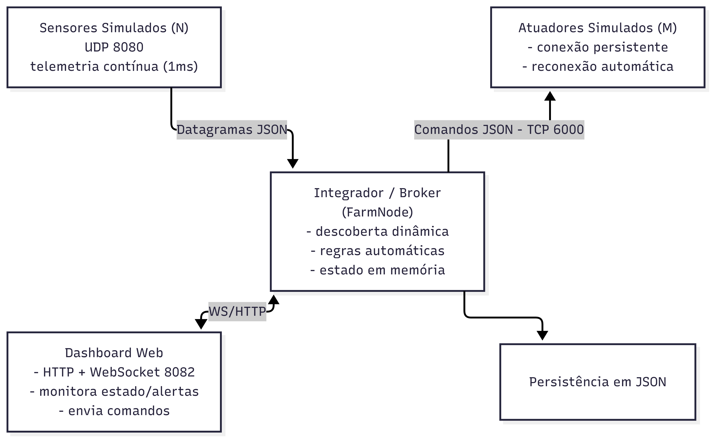
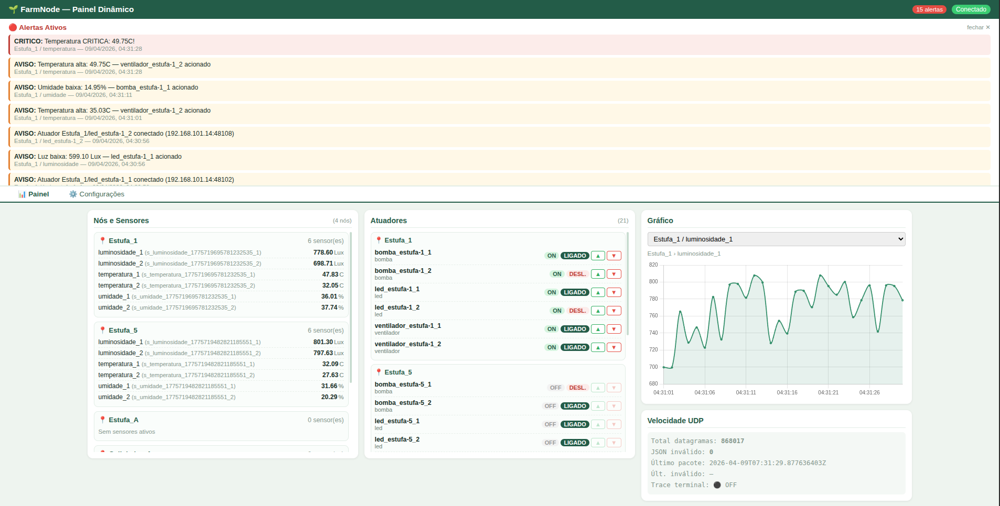
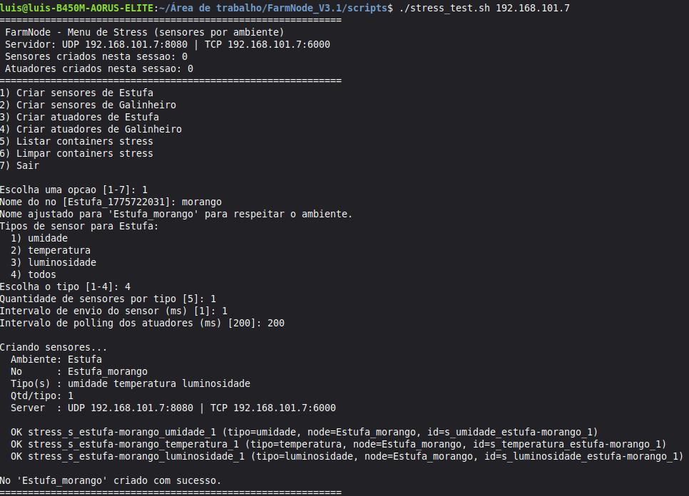
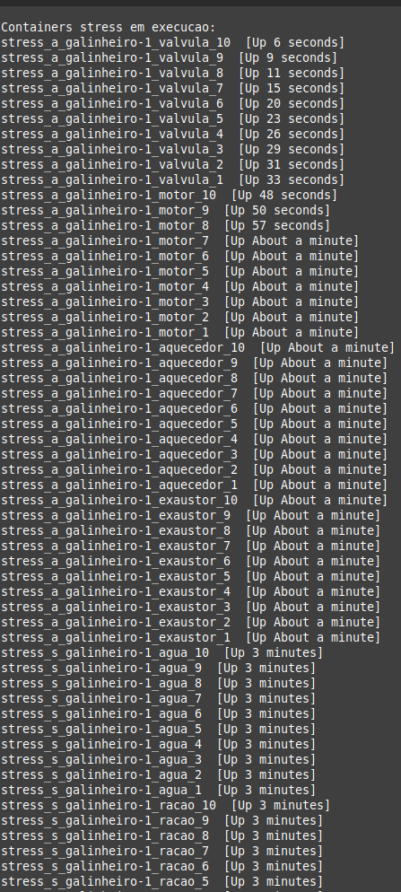
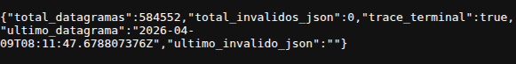

# FarmNode - TEC502 - Problema 1 (Rota das Coisas)

Sistema IoT distribuído para integração entre sensores, atuadores e aplicação cliente, desenvolvido sem framework de mensageria, usando apenas comunicação nativa da arquitetura da Internet (UDP/TCP/HTTP/WebSocket).

## 1. Objetivo do Projeto

Este projeto resolve o problema de alto acoplamento entre dispositivos e aplicações por meio de um **serviço de integração central (broker)**.

No cenário original, cada sensor precisaria abrir conexões diretas para várias aplicações. Nesta solução:

- sensores enviam telemetria para o servidor de integração;
- atuadores mantêm conexão TCP com o servidor;
- clientes (dashboard) consomem dados em tempo real e enviam comandos via WebSocket;
- o servidor centraliza regras, roteamento e persistência.

## 2. Arquitetura e Componentes

### 2.1 Componentes principais



1. **Dispositivos virtuais simulados (cmd/client + internal/simulador)**

   - Sensores: geram dados contínuos (1ms) e enviam via UDP.
   - Atuadores: conectam via TCP e recebem comandos do servidor.
2. **Serviço de integração (cmd/server)**

   - Recebe telemetria UDP (sensores).
   - Mantém conexões TCP persistentes com atuadores.
   - Executa regras automáticas de acionamento.
   - Expõe dashboard HTTP + WebSocket.
   - Persiste histórico e alertas em JSON.
3. **Aplicação cliente (dashboard Web)**

   - Visualiza dados em tempo real.
   - Envia comandos de controle.
   - Reconhece alertas.
   - Consulta histórico e configurações.

### 2.2 Fluxo resumido

1. Sensor simulado envia JSON via UDP para `:8080`.
2. Servidor processa, atualiza estado e regras.
3. Se necessário, servidor envia comando TCP para atuador conectado em `:6000`.
4. Servidor publica estado/alertas via WebSocket (`/ws`) para dashboard.
5. Dashboard pode enviar comandos manuais e ajustes de configuração.

## 3. Perfis de Tráfego e QoS

A solução separa os perfis de tráfego conforme o problema:

- **Telemetria contínua (alta frequência): UDP**

  - prioridade para baixa latência;
  - perdas pontuais toleráveis;
  - servidor usa worker pool e fila para alto volume.
- **Comandos críticos: TCP**

  - conexão persistente com atuadores;
  - confiabilidade maior para comandos de controle;
  - verificação de disponibilidade do atuador antes de acionar.

## 4. Protocolo (API remota e mensagens)

### 4.1 Sensor -> Servidor (UDP :8080)

Formato `MensagemSensor` (JSON):

```json
{
  "node_id": "Estufa_A",
  "sensor_id": "sensor_umidade_01",
  "tipo": "umidade",
  "valor": 42.7,
  "unidade": "%",
  "timestamp": "2026-04-06T12:00:00Z",
  "status_leitura": "normal"
}
```

### 4.2 Atuador -> Servidor (TCP :6000)

Handshake inicial `RegistroAtuador` (JSON em linha):

```json
{
  "node_id": "Estufa_A",
  "atuador_id": "bomba_irrigacao_01"
}
```

Comando enviado pelo servidor `ComandoAtuador`:

```json
{
  "node_id": "Estufa_A",
  "atuador_id": "bomba_irrigacao_01",
  "comando": "LIGAR",
  "motivo_acionamento": "umidade_baixa",
  "timestamp_ordem": "2026-04-06T12:00:01Z"
}
```

### 4.3 Regra de Framing TCP

No canal TCP, as mensagens são enviadas em **JSON delimitado por linha** (`\n`):

- o atuador abre conexão e envia 1 linha JSON de registro;
- o servidor responde com comandos, também em JSON por linha;
- o atuador processa linha a linha com scanner.

Isso evita ambiguidade de leitura em socket contínuo.

### 4.4 Dashboard <-> Servidor (WebSocket `/ws`)

Mensagens servidor -> cliente:

- `{"tipo":"estado","dados":{...}}`
- `{"tipo":"alerta","dados":[...]}`

Mensagens cliente -> servidor:

- Comando manual:
  - `{"tipo":"comando","node_id":"...","atuador_id":"...","comando":"LIGAR|DESLIGAR"}`
- Reconhecimento de alerta:
  - `{"tipo":"ack_alerta","id":"..."}`
- Atualização de configuração:
  - `{"tipo":"config","node_id":"...","dados":{...}}`

### 4.5 Endpoints HTTP

- `GET /dashboard` - interface web
- `GET /api/estado` - estado atual
- `GET /api/sensor/{tipo}?horas=...` - histórico por tipo
- `GET /api/atuador/history?horas=...` - histórico de atuadores
- `GET /api/alertas?ativos=true|false` - alertas
- `GET /api/config` - configuração atual
- `GET /api/velocidade` - contador de datagramas, inválidos JSON e últimos timestamps

### 4.6 Tratamento de Erros e Limites

- UDP com JSON inválido é descartado e contabilizado em `GET /api/velocidade` (`total_invalidos_json`).
- Comandos manuais via WebSocket retornam evento `comando_resultado` com `ok=true|false` e `erro` quando aplicável.
- Leituras UDP usam buffer de 4096 bytes por datagrama no servidor.

### 4.7 Especificação Formal (Fluxo, Sincronização e Erros)

#### UDP Sensor -> Servidor

- Transporte: datagrama UDP (sem handshake).
- Formato: JSON UTF-8 no corpo do datagrama.
- Sincronização: cada datagrama é uma leitura independente (não há estado de sessão).
- Tamanho efetivo: servidor lê até 4096 bytes por datagrama.
- Erro de formato: JSON inválido é descartado; contador e timestamp são expostos em `/api/velocidade`.

#### TCP Atuador <-> Servidor

- Handshake inicial: atuador envia exatamente 1 JSON `RegistroAtuador` ao conectar.
- Framing: JSON delimitado por (line-delimited JSON).
- Fluxo:
  1. Atuador conecta em `:6000`.
  2. Envia `RegistroAtuador`.
  3. Servidor registra e mantém conexão persistente.
  4. Servidor envia `ComandoAtuador` sob demanda.
  5. Atuador processa e permanece conectado (keepalive).
- Timeouts:
  - leitura de registro inicial: 5s;
  - escrita de comando no servidor: 2s;
  - conexão do atuador para reconexão: `DialTimeout` 5s + backoff exponencial.
- Erro de fluxo:
  - registro inválido/ausente: conexão encerrada;
  - falha de envio: atuador marcado desconectado e comando retorna falha;
  - tentativa de comando em atuador offline: rejeitada com alerta.

#### WebSocket Dashboard <-> Servidor

- Evento periódico do servidor: `estado` (snapshot de nós/sensores/atuadores).
- Evento assíncrono de alertas: `alerta`.
- Evento assíncrono de resultado de comando: `comando_resultado` (`ok`, `erro`, `node_id`, `atuador_id`, `comando`).
- Mensagens cliente -> servidor:
  - `comando`
  - `ack_alerta`
  - `config`
- Erro de payload de comando: servidor responde `comando_resultado` com `erro=payload_invalido`.

## 5. Concorrência e Desempenho

- Worker pool UDP configurável por ambiente (`UDP_WORKERS`, `UDP_QUEUE_SIZE`) e buffer de socket (`UDP_READ_BUFFER_BYTES`).
- Broadcast WebSocket para múltiplos clientes simultâneos.
- Filtro de persistência de sensores para reduzir escrita em disco:
  - salva por variação mínima (`LogMinVariacao = 0.5`) ou por intervalo (`LogMinIntervalo = 2s`);
  - limite de gravação por sensor para evitar crescimento explosivo sob carga.
- Throttle de alertas para evitar repetição excessiva.
- Throttle de avaliação de regras automáticas por sensor/tipo para reduzir sobrecarga sob alta frequência.

## 6. Confiabilidade Básica

- Descoberta dinâmica de sensores/atuadores no primeiro pacote/mensagem.
- Nomeação automática de sensores por nó e tipo (`temperatura_1`, `temperatura_2`, ...).
- Monitoramento de inatividade e expiração de dispositivos após 5 minutos sem atividade.
- Comando só é efetivado quando o atuador está disponível.
- Atuadores reconectam automaticamente em caso de falha.
- Tratamento de erros de parse/validação em mensagens JSON.

## 7. Estrutura de Diretórios

```text
.
├── cmd/
│   ├── server/
│   │   ├── server_main.go
│   │   ├── dashboard.go
│   │   └── Dockerfile
│   └── client/
│       ├── client_main.go
│       └── Dockerfile
├── internal/
│   ├── logger/
│   ├── models/
│   ├── network/
│   ├── simulador/
│   ├── state/
│   └── storage/
├── docker-compose.yml
├── go.mod
└── go.sum
```

## 8. Pacotes e Tecnologias

- Go 1.23
- Biblioteca padrão Go
- Docker / Docker Compose
- Chart.js no dashboard (CDN)

## 9. Pré-requisitos

- Docker Engine 24+ (ou equivalente compatível)
- Docker Compose v2+
- Go 1.23+ (apenas para execução sem Docker)

## 10. Variáveis de Ambiente

| Variável                 | Onde usar               | Exemplo                            | Descrição                                     |
| ------------------------- | ----------------------- | ---------------------------------- | ----------------------------------------------- |
| `SERVER_ADDR`           | atuadores/client direto | `SERVER_ADDR=192.168.1.10:6000`  | endereço TCP do servidor                       |
| `SERVER_IP`             | sensores/client direto  | `SERVER_IP=192.168.1.10:8080`    | endereço UDP do servidor                       |
| `SENSOR_INTERVAL_MS`    | simuladores de sensor   | `SENSOR_INTERVAL_MS=1`           | intervalo de envio (ms)                         |
| `ATUADOR_POLL_MS`       | simuladores             | `ATUADOR_POLL_MS=1000`           | intervalo de polling de estado no servidor (ms) |
| `UDP_WORKERS`           | servidor                | `UDP_WORKERS=128`                | quantidade de workers de processamento UDP      |
| `UDP_QUEUE_SIZE`        | servidor                | `UDP_QUEUE_SIZE=131072`          | tamanho da fila de pacotes UDP                  |
| `UDP_READ_BUFFER_BYTES` | servidor                | `UDP_READ_BUFFER_BYTES=16777216` | buffer de leitura do socket UDP                 |

## 11. Como Executar

### 11.1 Execução local completa (1 máquina)

```bash
docker compose up --build
```

Acessos:

- Dashboard: `http://localhost:8082/dashboard`
- UDP sensores: `localhost:8080/udp`
- TCP atuadores: `localhost:6000`

### 11.2 Execução com scripts dinâmicos

Subir apenas o servidor:

```bash
docker compose up --build -d
```

Adicionar sensores dinamicamente:

```bash
./scripts/add_sensor.sh umidade Estufa_A 5
```

Adicionar atuadores dinamicamente:

```bash
./scripts/add_atuador.sh bomba Estufa_A 2
```

Teste de estresse:

```bash
./scripts/stress_test.sh
```

### 11.3 Execução em mais de uma máquina (rede local)

Use quando o servidor roda em uma máquina e os simuladores em outra.

Máquina A (servidor):

```bash
cd "/caminho/FarmNode
"
docker compose up --build -d
```

Descubra o IP da Máquina A (exemplo: `192.168.101.7`) e mantenha portas liberadas: UDP `8080`, TCP `6000`, HTTP `8082`.

Máquina B (sensores/atuadores):

```bash
cd "/caminho/FarmNode"
./scripts/add_sensor.sh temperatura Estufa_A 5 192.168.101.7
./scripts/add_atuador.sh ventilador Estufa_A 2 192.168.101.7:6000
```

Opcional (menu de carga remoto):

```bash
./scripts/stress_test.sh 192.168.101.7 6000
```

Dashboard (em qualquer máquina da rede):

```text
http://192.168.101.7:8082/dashboard
```

## 12. Como Usar

1. Suba os containers.
2. Abra `http://<host>:8082/dashboard`.
3. Acompanhe sensores em tempo real.
4. Acione atuadores manualmente pelos botões.
5. Verifique alertas críticos/avisos e histórico.
6. Ajuste limites de configuração pela aba de configurações.
   

## 13. Persistência e Logs

Os dados ficam em `./logs` (volume Docker):

- `sensor_logs.json`
- `atuador_logs.json`
- `alertas.json`

## 14. Testes

### 14.1 Testes automatizados (Go)

```bash
go test ./...
```

Cobertura implementada no código:

- `internal/state/environment_test.go`
  - mapeamento estável sensor->atuador por chave
  - round-robin quando não há chave
  - fallback de identificação para atuador LED
- `internal/simulador/config_test.go`
  - limites de `envDurationMS`
  - parsing de tipo de atuador por `atuador_id`
- `cmd/server/ws_protocol_test.go`
  - encode/decode de frame WebSocket texto
  - decode de frame mascarado (cliente -> servidor)
- `cmd/server/api_velocidade_test.go`
  - contrato mínimo de campos em `/api/velocidade`

### 14.2 Teste de carga e desempenho (múltiplos dispositivos)

1. Subir servidor:

```bash
docker compose up --build -d
```

2. Rodar stress interativo:

```bash
./scripts/stress_test.sh <IP_SERVIDOR>
```



4. Medir ingestão e erros UDP:

```bash
curl http://<IP_SERVIDOR>:8082/api/velocidade
```

Indicadores observados:

- `total_datagramas` (vazão recebida)
- `total_invalidos_json` (erros de payload)
- `ultimo_datagrama` / `ultimo_invalido_json` (temporalidade)Verificar controle de atuadores e feedback:
- enviar comandos no dashboard;
- confirmar evento de retorno `comando_resultado` e logs em `atuador_logs.json`.



## 15. Limitações Conhecidas

- Telemetria em 1ms gera volume muito alto; o sistema reduz gravação em disco por filtro de persistência.
- O dashboard foi projetado para monitoramento operacional, não para histórico de longo prazo. (logs em formato JSON são gerados, de modo que possam ser consultados posteriormente)
